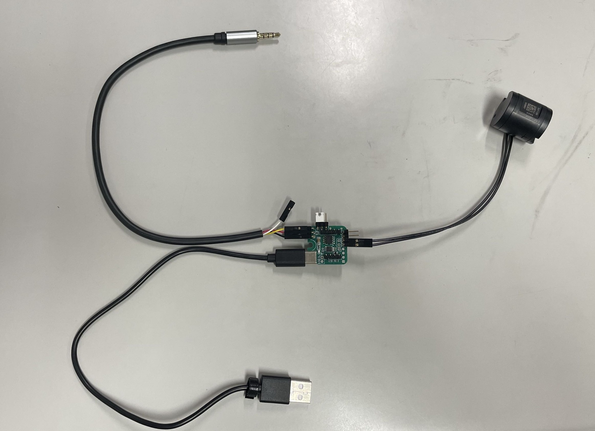
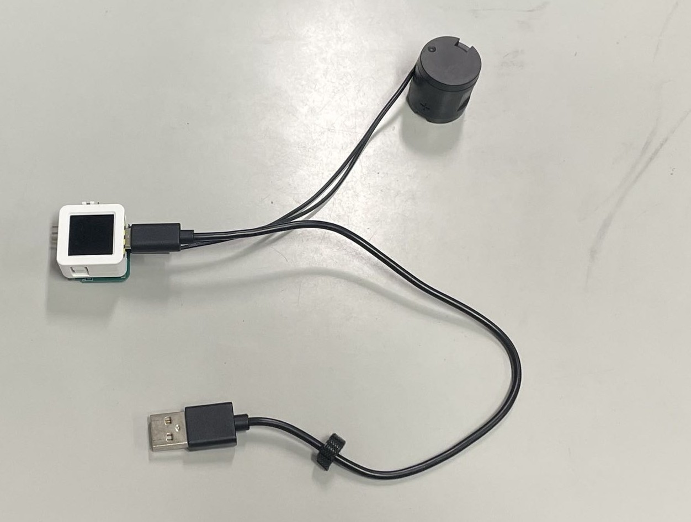

# duchap: Haptic Actuator Driver Board

## 概要

本プロジェクトは、触覚アクチュエーターを駆動するためのドライバーボードです。  
Foster社製の触覚アクチュエーターを対象としており、**アナログ入力とデジタル制御の両方に対応**した構成となっています。

1枚のボードで

- オーディオ信号による **アナログ駆動**
- マイコンによる **デジタル制御駆動**

の両方を利用できるよう設計されています。

本設計は Bit Trade One 社の **Assembly Desk License (ADL)** 公開製品をベースに改良されています。

---

## 製品説明

本ボードは **Foster社製触覚アクチュエーター**を駆動するためのドライバーです。

特徴

- アナログ / デジタルの両方式に対応
- USB Type-C 給電
- コンパクトな1ボード構成
- マイコン制御による振動パターン再生が可能

従来は

- アナログ駆動回路
- デジタル制御回路

が別構成になることが多いですが、本ボードでは **1つの基板に統合**されています。

---

## アナログでの使い方

アナログモードでは、オーディオ信号を入力することで振動を再生できます。

### 手順

1. USB Type-C ケーブルで電源を接続
2. オーディオ入力を接続
3. 下記の参考動画を再生

振動がオーディオ信号に応じて出力されます。

### 参考動画

- https://www.youtube.com/watch?v=OYqQZCnmybw
- https://www.youtube.com/watch?v=dnwXpK6lNK8

---

## デジタルでの使い方

デジタルモードでは、マイコンから振動パターンを制御できます。

### 必要なもの

- M5Stack **AtomS3**
- PlatformIO 開発環境
- 本製品

### 手順

1. AtomS3 を接続
2. PlatformIO でファームウェアを書き込み
3. 振動パターンを再生

これにより、ソフトウェアから自由に触覚パターンを生成できます。

---

### ライセンス

本プロジェクトは **MIT License** のもとで公開されています。
